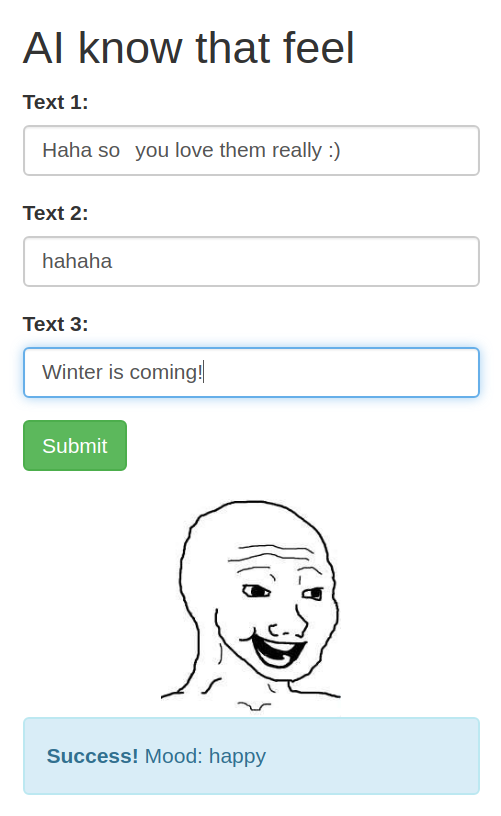

# Workshop


**This repository is intended for didactic purposes only.**

The target is to build a bot (software agent) that "identifies the sentiment" of a conversation and embed it into a webapp.

During the workshop a github app (link provided by the lecturer) is installed on the repository to automatically evaluate a metric or a set of metrics on the models pushed to the forks.

Workflow:
- The repository is forked and the github app (link provided by the lecturer) is installed
- Introductory examples are presented
- A ML model is trained and stored in models/model.h5 (e.g. Example 2) 
- A software agent in webpage/agent/wojak.py is embedded into a webapp (flask, webpage/sentiment.py). This agent uses the trained model to infer the sentiment of a conversation.

#### Webapp with the embedded agent using the ML model


#### Examples

- [Example 0](Workshop1_example_0_0.ipynb):
    - Basic example from scratch.
    - Take aways:
        - Model: Linear regression
        - Error, Loss, Cost, Objective
        - Gradient descent, step size, convergence
        - Inference
- [Example 1](Workshop1_example_1.ipynb):
    - Classic, crude sentiment analysis on the IMDB database
- [Example 1.1](Workshop_example_1.1.ipynb):
    - A very basic word encoder
- [Example 2](Workshop1_example_2.ipynb):
    - Creating the bot model: Applying the example code to our target problem
- [Example 3](Workshop_example_3.ipynb):
    - Test the bot model: Simple model evaluation
- [Example 4](Workshop1_example_4_TPU.ipynb):
    - Creating the bot: Using specialized hardware GPU/TPU

#### Running the webapp

[More info on running flask apps](https://flask.palletsprojects.com/en/1.1.x/cli/)

Linux
```bash
export FLASK_APP=webpage/sentiment.py
flask run --port 5001
```
Windows PowerShell:
```cmd
$env:FLASK_APP = "webpage/sentiment.py"
flask run --port 5001
```

#### Description of additional content

These files are intended to aid and orchestrate the process and are not needed to be modified.

- evaluate_model.py:
    - Used within a container (see ./Dockerfile) to evaluate the model by the scoring engine
- data_dev:
    - development dataset, plaintext
- data_test:
    - testing dataset used by the scoring mechanism, encrypted
- data_train:
    - train dataset used to train the model
- libs:
    - Helping functions, e.g. nicer visualization in tensorboard or an example evaluation of the model
- models:
    - **models/model.h5**: main model evaluated by the scoring engine and used by the agent
    - .easeml.yml: used by the scoring engine, should remain untouched for this workshop. More info see CI @ [Ease.ml](http://ease.ml/)
- wojac_test.ipynb:
    - Test the agent and model without the webapp
- webpage:
    - webapp and agent code

#### Sentiments
- NPC used as no sentiment/default

As per the dataset labels:
- Other
- Sad
- Happy
- Angry

     


## Badgen.net

State of the evaluation engine on this repository (needs to be modified to reflect forks)


<!---

## Shields.io


--->
